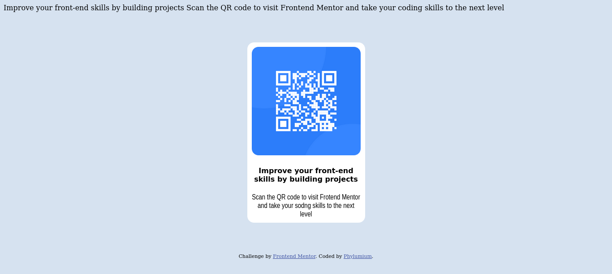

# Frontend Mentor - QR code component solution

This is a solution to the [QR code component challenge on Frontend Mentor](https://www.frontendmentor.io/challenges/qr-code-component-iux_sIO_H). Frontend Mentor challenges help you improve your coding skills by building realistic projects. 

## Table of contents

- [Overview](#overview)
  - [Screenshot](#screenshot)
  - [Links](#links)
- [My process](#my-process)
  - [Built with](#built-with)
  - [What I learned](#what-i-learned)
  - [Continued development](#continued-development)
  - [Useful resources](#useful-resources)
- [Author](#author)

## Overview

### Screenshot



### Links

- Solution URL: [Add solution URL here](https://your-solution-url.com)
- Live Site URL: [Add live site URL here](https://your-live-site-url.com)

## My process

### Built with

- Semantic HTML5 markup
- CSS custom properties

For styles


### What I learned

I learnt more about boxes than i previously thought i knew.
Also, found out that not every problem has to be fixed with a flex-box when there are easier ways to solve them.
For instane, i learnt to position a box in the center with;
'''Html
<div class="center-box">This is a box</div>
'''

```css
.center-box{
  margin: 0 auto;
}
```
 I also learnt to load up images and size them accordingly.

### Continued development

Every element in html is a box. So focusing on understanding it completely will prove to be beneficial to me in the long run.
 I would also learn to journal all my process. From planning, coding and learning processes for easier reference.
### Useful resources

I watched alot of youtube videos and read a number of articles, but i did not journal my sources.

## Author

- Website - [Add your name here](https://www.your-site.com)
- Frontend Mentor - [@yourusername](https://www.frontendmentor.io/profile/yourusername)
